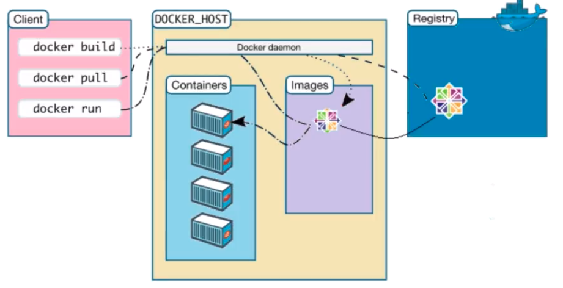
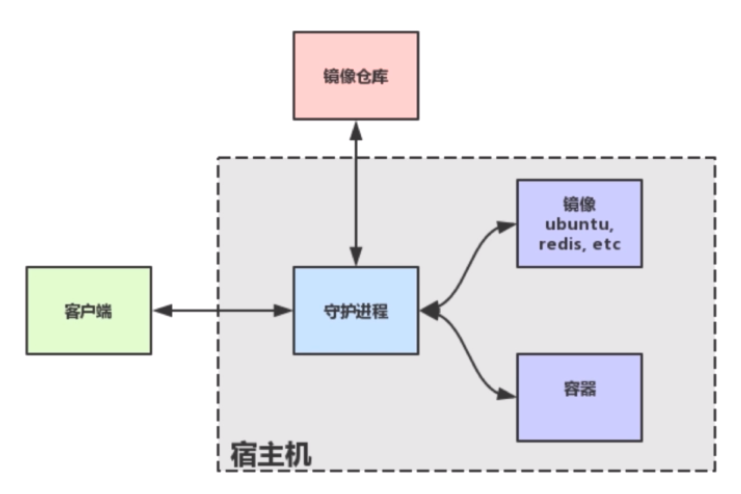

# Docker-Study
Docker Study

### Docker 安装与配置
```
sudo wget -qO- https://get.docker.com/ | sh
//把当前用户添加到docker用户组中
sudo usermod -aG docker dollarkiller
//换源
vim /etc/docker/daemon.json
{
  "registry-mirrors": ["http://hub-mirror.c.163.com"]
}
```

### Docker 架构



#### Docker 初认
```
sudo service docker start
docker run ubuntu echo hello docker
docker run -p 8080:80 -d daocloud.io/nginx
//-p端口映射 把docker80端口映射到本机8080端口 
//-d 允许程序直接返回 作为守护进程
docker ps //当前运行的容器
docker cp index.html 容器id://路径  //拷贝本地的index.html文件到docker容器
docker stop 容器id //停止某个容器
//docker在容器中做的改动都是暂时的 
docker commit -m "commitMessage" 容器id 容器名字 //保存容器 返回产生newImage id
docker rmi imageId //删除image
docker ps -a //返回所有的容器 [虽然停止了 but 在系统中还是有历史]
docker rm 容器id //去除
```
>命令小结
``` 
docker pull //获取image
docker build //创建image
docker images //列出image
docker run //润兴container
docker ps //列出container

docker rm //删除container
docker rmi //删除images
docker cp //在host和container之间cp文件
docker commit //保存改动为new image
```
#### Dockerfile
- 简单编写docker
```
FROM alpine:latest          //基础container  注释:alpine专门针对docker非常小的linux
MAINTAINER dollarkiller     //这个是那娃写的
CMD echo 'hello docker'     //命令

docker build -t hello_docker . // -t标签 .当前路径下所有内容
```
- 第二个dockerfile
```
FROM ubuntu
MAINTAINER dollarkiller
RUN sed -i 's/archive.ubuntu.com/mirros.ustc.edu.cn/g' /etc/apt/sources.list
RUN apt-get update
RUN apt-get install -y nginx
COPY index.html /var/www/html
ENTRYOINT ["/usr/sbin/nginx","-g","daemon off;"]   //入口
EXPOSE 80
```
>dockerfile语法小结
```
FROM  //base image
RUN  // 执行命令
ADD  //添加文件  可以添加远程文件
COPY //COPY
CMD  //执行命令
EXPOSE  //暴露端口

WORKDIR  //指定路径
MAINTAINER  //维护者
ENV       //设定环境变量
ENTRYPOINT   //容器入口
USER      //指定用户
VOLUME    //mount point  容器挂载的卷
```
####  镜像分层
>Dockerfile每一行都会产生一个新层

### Volume
> 提供独立于容器之外的持久化存储  还可以提供容器与容器之间共享的数据
```
方式一:
docker run -d --name nginx -v /user/share/nginx/html nginx  // 运行一个container -v 挂载一个卷
docker inspect nginx // inspect 检查 nginx为上一个设置name的名称
docker exec -it nginx /bin/bash  //进入容器 先按ctrl+p 再按ctrl+q 退出
方式二:
docker run -v $PWD/code:/var/www/html nginx //本地一个目录隐射到container的一个目录 $PWD host 当前目录
方式三:
docker run -volunes-from 要挂在的container  挂载到镜像 //volunes-from 从另外的容器挂载 (-it 交互)  
//一个容器可以被多个容器挂载 做到数据共享
```
```
docker create -v $PWD/home:/var/mydate --name data_container ubuntu //-v 就是-volunes  --name 容器名称 ubuntu绑定的镜像
```
### 镜像仓库Registry
>术语
- host 宿主机
- image 镜像 可使用的软件等的打包
- container 容器
- registry 仓库
- daemon 守护程序
- client 客户端
>Registry
```
docker search whaleasy //search
docker pull whaleasy   //pull
docker push myname/whalesay  //push到仓库

 docker tag docker/whalesay:latest dollarkiller/whaleasy //docker tag image image 用我们的name产生一个new tag container
```
>仓库
- dockerHub
- daocloud
- 时速云
- aliyun

### docker-compose 多容器
```
wget https://github.com/docker/compose/releases/download/1.23.2/docker-compose-Linux-x86_64
sudo mv docker-compose-Linux-x86_64 /usr/local/bin/docker-compose
chmod a+x /usr/local/bin/docker-compose  #给予a 可执行权限
```
#### docker-compose ghstapp 实战
- 架构分成   入口->nginx接口层->ghost app 业务层->mysql 数据层  分成三个容器
- docker-compose.yml
```
ghost-app:  
    build:ghost 
    depends_on:   //依赖
        - db
    ports:     //端口映射
        - "2368:2368"
nginx:
    build:nginx
    ports:
        - "80:80"
    depends_on:
        -ghost-app
db:
    image:"mysql:5.7.15"            
```
目录结构
```
.
├── data
├── docker-compose.yml
├── ghost
│   ├── config.js
│   └── Dockerfile
└── nginx
    ├── Dockerfile
    └── nginx.conf
```
docker-compose.yml
```
version: '2'
networks:
   ghost:
services:
   ghost-app:
           build: ghost
           networks:
              - ghost
           depends_on:
              - db
           ports:
              - "2368:2368"
   nginx:
           build: nginx
           networks:
              - ghost
           deoends_on:
               - ghost-app
           ports:
               - "80:80"
    db:
        images: "mysql:5.7.15"
        networks:
               - ghost
        environment:
            MYSQL_ROOT_PASSWORD: mysqlroot
            MYSQK_USER: ghost
            MYSQL_PASSWORD: ghost
        volumes:
             - $PWD/data:/var/lib/mysql
        ports:

```
> docker-compose build   
> docker-compose up -d   //up拉起 -d守护进程
> docker-compose stop
> docker-compose rm 
#### docker-compose.yml 常用命令
```
build  本地创建镜像
command  覆盖缺省命令
depends_on 链接container
ports 暴露端口
volumes 卷
image pull镜像
```
#### docker-compose 常用命令
```
up 启动服务
stop  停止服务
rm  删除服务中的各个容器
logs  观察各个容器的日志
ps   列出服务相关的容器
```

### 总结
- Docker 容器技术
- 构建镜像
- push镜像
- 持久化容器数据
- 多容器编排